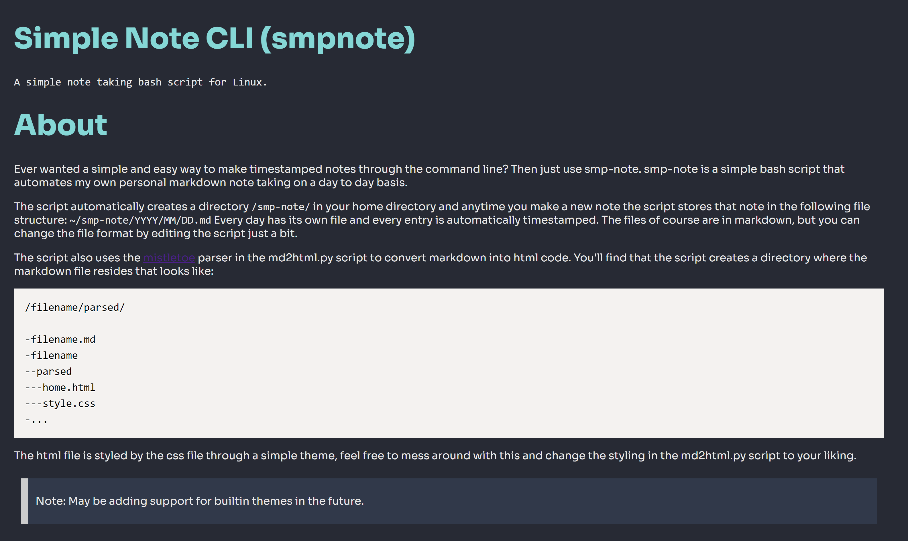

# Simple Note CLI (smpnote)
	A simple note taking bash script for Linux.



# About
Ever wanted a simple and easy way to make timestamped notes through the command line? Then just use smp-note.
smp-note is a simple bash script that automates my own personal markdown note taking on a day to day basis.

The script automatically creates a directory `/smp-note/` in your home directory and anytime you make a new note the script stores that note in the following file structure: `~/smp-note/YYYY/MM/DD.md`
Every day has its own file and every entry is automatically timestamped. The files of course are in markdown, but you can change the file format by editing the script just a bit.

The script also uses the [mistletoe](https://github.com/miyuchina/mistletoe?ref=pythonrepo.com) parser in the md2html.py script to convert markdown into html code.
You'll find that the script creates a directory where the markdown file resides that looks like: 
```sh
/filename/parsed/

-filename.md
-filename
--parsed
---home.html
---style.css
-...
```
The html file is styled by the css file through a simple theme, feel free to mess around with this and change the styling in the md2html.py script to your liking.
> Note: May be adding support for builtin themes in the future.

# Setup

## Linux
First git clone the repo to some permanant installation directory.

You probably want to use the script globally so first thing you are probably going to want to do is add the script to your path
Now keep note of wherever you installed it just go into your `.bashrc` or `.zshrc` depending on which shell your using and add the following:
```sh
export PATH="$PATH:/installation/directory"

# Below you can make the script easier to use by aliasing it to whatever you want so you dont have to type `smpnote.sh` every time.
alias smpnote="smpnote.sh"
```

On line 17 you can also change the following to change which editor you want to use:
```sh
09 # Change this to your editor of choice
10 editor() { vim $1; }
```
I like VIM so i use it by default but you can use `nano` or `emacs` or even GUI applications that can launch through the terminal like Visual Studio `code`.

You also need to install mistletoe through pip: `pip install mistletoe` or `pip3 install mistletoe`. This is needed for python script.

> FYI: you may need to go into the script and edit the `parser() {}` function to use `python` instead of `python3` depending on how it's set up on your system.

You should be able to use `smpnote` now!

## MacOS
I dont have a Mac so i cant test this really but if someone can please let me know if it works (it should), or if it doesnt.

## Windows Using WSL
Works the same as the Linux section. Just clone repo, add to path and alias and you'll be able to use the script.

## Example usage
> Note the lack of a leading `/` in the last example:
```sh
smpnote -h					# shows the help menu
smpnote <title>					# title of the entry
smpnote 'My first entry'			# to make a entry in todays markdown file
smpnote -p full/path/to/some/dir/file.md 	# to use the mistletoe parser on the file in that directory
```

30.md
```md
# My first entry
## 11:55 PM
```

> FYI: My code isnt checking for any malicios or incorrect input, so use at your own risk or modify the script to do so
> FYI: Images need to be exported into the corresponding folders, minimal work but tedious nonetheless. Will fix soon.

## Planned upcoming features
- [] Improvements and bug fixes for the current script
- [] Powershell version (for Windows)
- [] Support for themes

> Feel free to contribute or fork the repository to make your own changes to the script.
